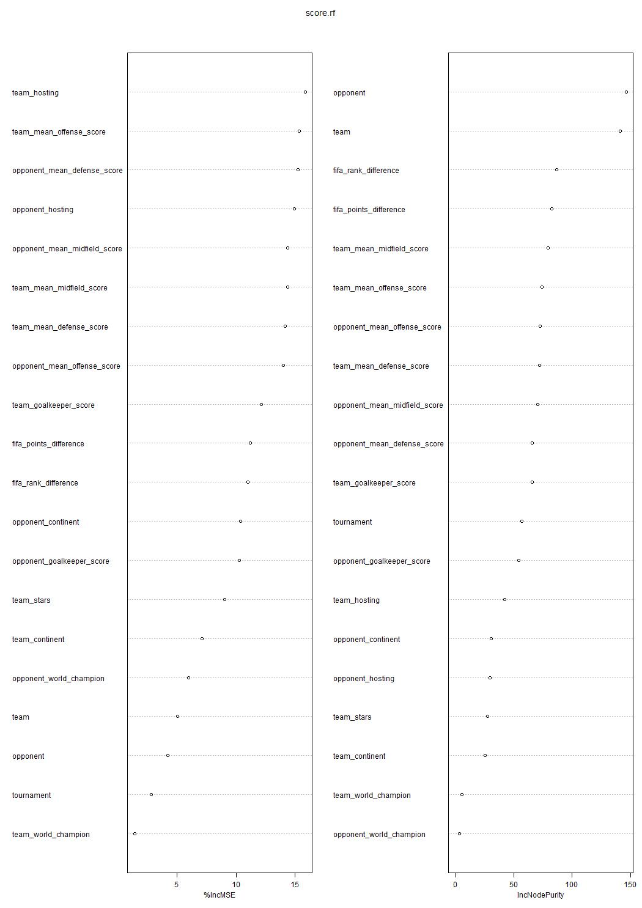
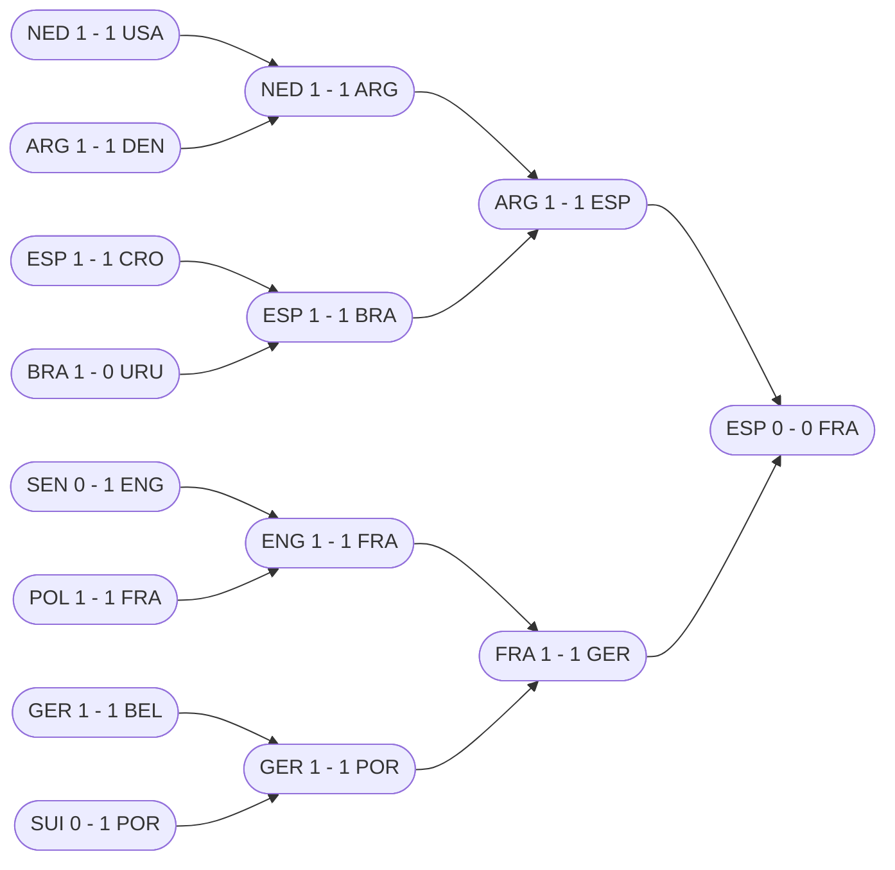

# Predicting FIFA World Cup 2022

## Data

A database was provided to us by the organizers of the challenge.

### Data Transformation

We had to reconfigure the dataset so as to be able to study the performance at team-level for each game, as opposed to studying the outcome at game-level.

| Date      | home_team | away_team | home_team_fifa_rank | away_team_fifa_rank | home_team_score | away_team_score | tournament     | neutral_location |
| --------- | --------- | --------- | ------------------- | ------------------- | --------------- | --------------- | -------------- | ---------------- |
| 7/10/2018 | France    | Belgium   | 2                   | 5                   | 1               | 0               | FIFA World Cup | TRUE             |

Transformed into

| Date      | team    | opponent | fifa_rank_difference | team_score | tournament     | team_hosting | opponent_hosting |
| --------- | ------- | -------- | -------------------- | ---------- | -------------- | ------------ | ---------------- |
| 7/10/2018 | France  | Belgium  | 3                    | 1          | FIFA World Cup | False        | False            |
| 7/10/2018 | Belgium | France   | -3                   | 0          | FIFA World Cup | False        | False            |

### Data Cleaning

We cleaned the dataset that we had by selecting the rows in which the teams taking part in the 2022 World Cup were represented (32 teams) + a bunch of other high-qualityteams that will not play in the World Cup but that can still be relevant to train our prediction model. The goal was to avoid having low-end teams shaping our model.

RandomForest models allow for up to 53 possibilities for one variables, so we could keep 21 extra teams. The selected teams are in [countries_selection.csv](data-raw/countries_selection.csv).

### Data Preparation

As performance indicators for the prevision of goals, we chose to keep the goalkeeper, defense, midfield and offense scores alredy present in the dataset and to add additional indicators such as stars (= how many World Cups had the team won at the moment of the game) and hapiness index of the team's country at the time of the game. Some teams' scores were missing so we took the computation method from Kaggle and added them ourselves.

## Modelling

### Random Forest 

To model the number of goals a team scores in a given match, we decided to use a Random Forest for several reasons:
- Within the team, we were all comfortable with this method which gave us more time to tune it properly.
- We did not want to make any assumption of linearity between the predictors and the number of goals.
- We thought that this method would be easier to explain to a public not necessarily initiated.
- In view of the large number of qualitative predictors and their large number of different values, we thought that decision trees would handle them more easily.

### Variable Importance

## Simulation

To simulate world cups, we have chosen an object-oriented approach. Starting by creating a class to represent a team, we progressively made our simulation more complex by creating matches, then groups and knockout phases, until we were able to model an entire tournament. The few points of attention were to algorithmically reproduce the FIFA logic to break ties within the groups and the distribution of teams at the beginning of the knockout phase. In our simulations, the scores of the games were simulated using the results of our predictive model.

In addition, there is a report class that keeps track of the simulation results in order to give overall statistics. In fact, it counts the number of times each team manages to reach each phase during the simulations. By dividing these counts by the number of simulations, we obtain a percentage which we consider as the chance that a team reaches each phase. For example, if in 100 simulations Portugal reaches the quarter-finals 42 times, then Portugal is considered to have a 42% chance of reaching the quarter-finals.

### Class Diagram

### Most probable Outcome

